  

  

### ✦ toolbox

`python` · `typescript` · `react` · `flutter` · `jupyter` · `scikit-learn` · `streamlit` · `docker` · `postgres`

  <a href="https://alfa2k.github.io/alfa2k/"><code>~/portfolio</code></a> ·
  <a href="https://github.com/fahmed-00?tab=repositories"><code>~/repos</code></a>

header art: <a href="https://ascii.rest/desert-night/"><i>desert night</i></a> from <a href="https://ascii.rest">ascii.rest</a> (MIT)

